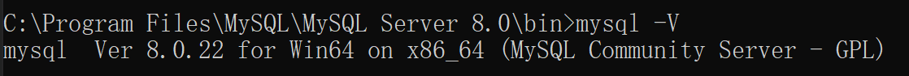
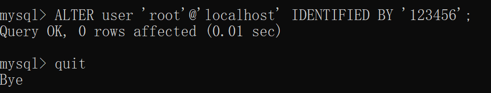

# 数据库

- **第一范式**（1NF）

  数据表的每一列（字段）必须是不可拆分的单元

- **第二范式**

  满足第一范式后要求表中所有的列都必须依赖于主键，而不能有任何一列与主键没有关系

- **第三范式**

  满足第二范式后要求表中的每一列都与主键直接相关

## MySQL

查看版本



**修改密码**

以管理员身份运行cmd

关闭mysql服务：**net stop mysql**

跳过授权表，进行免密登录：**mysqld --console --skip-grant-tables --shared-memory**

用管理员身份新打开一个控制台窗口，然后免密码登录Mysql：**mysql.exe -u root**

修改密码为空：**use mysql**

 **UPDATE mysql.user SET authentication_string=’’ WHERE user=‘root’;**

关闭所有窗口，重新打开并登录**mysql -u root -p**

 修改密码：**ALTER USER  'root'  @ 'localhost'  IDENTIFIED BY  '新密码';**



进入mysql后

```mysql
show databases; #查看数据库
use database_name;
show tables; #查看表
desc table_name; #查看表结构
create database database_name; #创建数据库
drop database database_name; #删除数据库
```

# Django

## 初识

Django 是一个由 Python 编写的一个开放源代码的 Web 应用框架。基于 MVC 模型，即 Model（模型）+ View（视图）+ Controller（控制器）设计模式。MVC模式是软件工程中的一种软件架构模式：

- 模型（M）- 编写程序应有的功能，负责业务对象与数据库的映射(ORM)。
- 视图（V）- 图形界面，负责与用户的交互(页面)。
- 控制器（C）- 负责转发请求，对请求进行处理。

Python 加 Django 是快速开发、设计、部署网站的最佳组合。

**设计模型**：在models中描述自己的数据模型	

**应用数据模型**：两条命令自动创建数据库表

​    `python manage.py makemigrations`  

​			查找所有可用的models，为任意一个在数据库中不存在对应数据表的model创建 				  			migrations 脚本文件
​	`python manage.py migrate`   运行 migrations 自动创建数据库表

**urls**：一个url调用相应的视图函数

**编写视图**：一个视图的工作就是：从参数获取数据，装载一个模板，然后将根据获取的数据对模板进行渲染。视图返回的结果只有两个：返回一个包含请求页面元素的 `HttpResponse` 对象，或者是抛出 `Http404`这类异常

**安装**需要python。鉴于已安装anaconda和pycharm，通过**pip install django**安装

## **创建项目**

使用终端命令或者通过pycharm进行创建

```text
django-admin.py startproject djangoDemo
```

init.py: 一个空文件，声明所在目录的包为一个Python包

settings.py: 管理项目的配置信息

urls.py: 声明请求url的映射关系

asgi.py（wsgi.py）: python程序和web服务器的通信协议

manage.py： 一个命令行工具，用来和Django项目进行交互

setting.py：项目配置文件

```text
# 语言设置 默认英语， 中文是zh-hans
LANGUAGE_CODE = 'en-us'
# 时区设置，中国的是：Asia/Shanghai
TIME_ZONE = 'UTC'
```

### **创建APP**

```
python manage.py startapp app_demo
```

admin:对应应用后台管理配置文件

apps:对应应用的配置文件

models:数据模块，用于设计数据库等

tests:编写测试脚本

views：视图层，直接和浏览器进行交互

每次新建一个APP，要将其在settings.py文件中的INSTALLED_APPS里进行注册，程序才能够找到这个服务

```python
INSTALLED_APPS = [
	...
    'app_demo',
]
```

### 编写视图

为了创建 URLconf，新建一个 `urls.py` 文件，将一个url映射到所写视图。在根 URLconf 文件中指定所创建的 `urls` 模块

- **include**（）：当包括其它 URL 模式时应该总是使用 `include()` 
  - 当包括其它 URL 模式时应该总是使用 `include()` ， 除了`admin.site.urls` 。
- **path**（）：

  - route：一个包含URL模式的字符串。必须

  - view：调用相关的视图函数。必须

  - kwargs：任意个关键字参数可以作为一个字典传递给目标视图函数。非必须

  - name：为你的 URL 取名，使能在 Django 的任意地方唯一地引用它，尤其是在模板中。允许只改一个文件就能全局地修改某个 URL 模式。

### 数据库配置

使用其它数据库时，需要settings中作相应配置。

```python
DATABASES = {
    'default': {
        'ENGINE': 'django.db.backends.mysql',
        'NAME':  'db',
        'USER': 'root',
        'PASSWORD': '123456',
        'HOST': '127.0.0.1',
        'PORT': 3306,
    }
}
```

### 创建模型

模型包含了储存的数据所必要的字段和行为。

给模型增加 `__str__()` 方法

#### 数据库迁移

```
python manage.py makemigrations polls #为模型的改变生成迁移文件
```

**sqlmigrate **命令自动执行数据库迁移并同步管理数据库结构

```
python manage.py sqlmigrate polls 0001
# 该命令并没有真正迁移，只是把命令输出到屏幕上，让你看看 Django 认为需要执行哪些 SQL 语句。想看 Django 准备做什么或当数据库管理员需要写脚本来批量处理数据库时会很有用。
```

```
python manage.py migrate #应用迁移
```

render（）：载入模板，填充上下文，再返回由它生成的HttpResponse 对象

### 模板

```django
{# if/else 标签 #}

     ... display


{# for标签 #}

{{ i }}

{# 加reversed反向迭代 #}


{# 比较值相等 #}

    <h1>Welcome!</h1>


 标签允许在模板中包含其它的模板的内容。


标签跨站请求伪造保护。
```

#### 模板继承

```django
父模板：
 
预留给子模板的区域，可以设置设置默认内容


子模版继承父模版：
 

所有的  标签告诉模板引擎，子模板可以重载这些部分。
相同名字的 block 标签直接替换掉目标html里的相应 block
```

### 表单

表单必须指定两样东西：

- *何地*：负责响应用户输入数据的URL地址
- *如何*：数据请求使用的HTTP方法。

#### GET与POST

处理表单时的的两种HTTP方法。

**GET**：将提交的数据捆绑到字符串中，并用其组成一个URL，该URL包含了数据要发送的地址以及一些键值对应的数据。

**POST**：封装表单数据。

## Django 管理页面

为站点管理人员创建统一的内容编辑界面。
