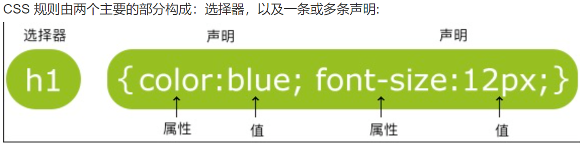

对于Web：

**HTML** 定义了网页的内容

**CSS** 描述了网页的布局

**JavaScript** 网页的行为

# HTML

**H**yper**T**ext **M**arkup **L**anguage，用来描述网页的一种语言。

- HTML 不是一种编程语言，而是一种**标记**语言
- 标记语言是一套**标记标签** (markup tag)
- HTML 使用标记标签来**描述**网页
- HTML 文档包含了HTML **标签**及**文本**内容
- HTML文档也叫做 **web 页面**

**HTML元素**：一个元素包含开始标签、元素内容、结束标签

**<!DOCTYPE html> 声明**为htlm5文档，声明有助于浏览器中正确显示网页，不区分大小写。

**标题** ：<h1> - <h6> 

**段落** ：<p> 

<!-- hr创建水平线 -->

<hr>

链接：<a>

```html
<a href="https://www.runoob.com">这是一个链接</a>
```

**图像**：

```html

```

```
<div> 标签定义 HTML 文档中的一个分隔区块或者一个区域部分
```

**DOM** (Document Object Model) **文档对象模型**，是 HTML 和 XML 文档的编程接口。HTML DOM 定义了访问和操作 HTML 文档的标准方法。

# CSS

**CSS** (Cascading Style Sheets)**层叠样式表**用于渲染HTML元素标签的样式。



CSS注释以 **/\*** 开始, 以 ***/** 结束

**CSS创建**

- **外部样式表**

  每个页面使用 <link> 标签链接到样式表。 <link> 标签在（文档的）头部：

  ```html
  <head> <link rel="stylesheet" type="text/css" href="mystyle.css"> </head>
  ```

- **内部样式表**

  使用 <style> 标签在文档头部定义内部样式表

  ```html
  <head> <style> hr {color:sienna;} p {margin-left:20px;} body {background-image:url("images/back40.gif");} </style> </head>
  ```

- **内联样式**

  慎用，类似内联函数，如当样式仅需要在一个元素上应用一次时使用内联样式，需要在相关的标签内使用样式（style）属性

  ```html
  <p style="color:sienna;margin-left:20px">这是一个段落。</p>
  ```
  
  **多重样式优先级**：**内联样式）Inline style > （内部样式）Internal style sheet >（外部样式）External style sheet > 浏览器默认样式**

# JavaScript

JavaScript 是 Web 的编程语言。所有现代的 HTML 页面都使用 JavaScript。

HTML 中的脚本必须位于 <script> 与 </script> 标签之间。脚本可被放置在 HTML 页面的 <body> 和 <head> 部分中。如使用外部文件，在 <script> 标签的 "src" 属性中设置该 .js 文件：

```html
<body> <script src="myScript.js"></script> </body> 
```

JavaScript 没有任何打印或者输出的函数。可以通过不同的方式来输出数据：

- 使用 **window.alert()** 弹出警告框。
- 使用 **document.write()** 方法将内容写到 HTML 文档中。
- 使用 **innerHTML** 写入到 HTML 元素。
- 使用 **console.log()** 写入到浏览器的控制台。

注释：单行//，多行/* */

# Vue.js

一套构建用户界面的渐进式JavaScript框架

## 安装

**1.独立版本**：官方下载，用 **<script>** 标签引入。

**2.使用CDN方法**：国内没有推荐

**3.NPM方法：**使用淘宝镜像及其命令cnpm。

```
# npm随node.js一起安装，查看版本
$ npm -v 
# 使用淘宝镜像
$ npm install -g cnpm --registry=https://registry.npm.taobao.org
```

**命令行工具**

```
# 全局安装 vue-cli
$ cnpm install --global vue-cli
# 创建一个基于 webpack 模板的新项目
$ vue init webpack myVueProject
```

这里出现错误：检查node、vue、webpack是否安装好。

因为webpack没有全局安装时，每次新建项目都需要重新安装webpack，否则报如下错误。


全局安装webpack后仍出现此报错。使用，再次创建后成功

```
# 进入项目安装并运行
$ cd vuedemo
$ cnpm run dev
```

可打开本地浏览器，在IDE中打开该项目

### vscode插件

- Vetur      Vue开发工具
- Open in Browser    将html文件在浏览器中打开
- ESLint       javascript 语法检查
- Prettier - Code formatter      代码格式化
- htmlhint     html语法检查
- stylelint：css 语法检查

## 语法

> Vue.js 使用了**基于 HTML** 的模版语法，允许开发者声明式地将 DOM 绑定至底层 Vue 实例的数据。
>
> Vue.js 的核心是一个允许你采用简洁的模板语法来声明式的将数据渲染进 DOM 的系统。
>

个人通俗理解：html只能定义静态的显示内容，通过JavaScript可定义其行为，Vue.js作为一个JavaScript框架提供了更简便的方法，一些底层的基本代码不需要自己去实现，即不需要手动操作DOM，Vue提供了很多API实现动态的数据绑定。（暂且这样理解，不知道对不对，学习深入了再改吧。）

使用的过程就是定义MVVM（Model-View-ViewModel ）的过程。

```vue
<!--定义View-->
<div id="app">{{message}}</div>
<script src="js/bue.js"></script>
<script>
    // 定义model
    var example={message:"hello"}
    //实例化，即创建一个ViewModel
    new Vue{{
        el:'#app'
        data:example
    }}
</script>
```

**data**用于定义属性，实例的属性为message；可以添加**methods** 来定义函数

### 指令

是带v-前缀的特殊属性

**v-if、v-show、v-else、v-for**

**v-model**：用来在 input、select、textarea、checkbox、radio 等表单控件元素上**创建双向数据绑定**，根据表单上的值，自动更新绑定的元素的值。

**v-bind**：动态绑定html属性

```html
<!-- 完整语法 -->
<a v-bind:href="url"></a>
<!-- 缩写 -->
<a :href="url"></a>
```

理解：数据绑定常用**文本插值**：（用双大括号）

```html
<p>{{ message }}</p>
```

**v-html**输出html代码，例：<div v-html="message"></div>，html的属性不能用{{ }}，而是用v-bind指令来绑定。

**v-on**：监听DOM事件

```vue
<!-- 完整语法 -->
<a v-on:click="doSomething"></a>
<!-- 缩写 -->
<a @click="doSomething"></a>
```

**参数**：如`v-bind：href...`href为参数

**修饰符**：指出指令以某种特定方式进行绑定，如**.prevent** 修饰符告诉 **v-on** 指令对于触发的事件调用 **event.preventDefault()**：

**template**标签，HTML5提供的新标签，更加规范和语义化 ；可以把列表项放入template标签中，然后进行批量渲染，template标签内容设置了display：none属性，不可见。在Vue中主要用于分组的条件判断和列表（v-if、v-for）渲染（批量渲染？高效？）。

## 计算属性&监听属性

**computed**：当其依赖属性的值发生变化时，这个属性的值会自动更新，与之相关的DOM部分也会同步自动更新。

{{1+2+3}}，需要显示运算后的数据，当运算复杂时，在{{ }}里直接运算比较复杂和不清晰，这时候将计算的函数写在**computed**里，它会动态计算。当相关依赖数据没有变化时，computed 直接调用缓存的数据，提高程序性能。而使用 methods 函数总会重新调用执行。

**getter**与**setter**：默认提供getter，可以理解为一个是读，一个是写（重新设值）。

**watch**：响应数据的变化

## 样式绑定

用v-bind设置。

- v-bind：class设置一个对象，动态切换

- 内联样式

  ```html
  <div id="app">
      <div v-bind:style="{ color: activeColor, fontSize: fontSize + 'px' }">hello</div>  
  </div>
  ...
  等价于
  <div style="color: green; font-size: 30px;">hello</div>
  ```

## 事件处理

用v-on事件监听：

```html
<button v-on:click="counter += 1">Add 1</button>
```

通常事件复杂，v-on可以接收一个需要调用的方法名称：

```html
<button v-on:click="greet">Greet</button> </div>
```

除了直接绑定到一个方法，也可以用内联 JavaScript 语句。

**事件修饰符**：如event.preventDefault() 或 event.stopPropagation()。

```html
<!-- 阻止单击事件冒泡 -->
<a v-on:click.stop="doThis"></a>
```

**按键修饰符**：使用按键码不容易记，因此Vue为常用按键提供了别名：

```html
<input v-on:keyup.13="submit">
<input @keyup.enter="submit">
Vue.config.keyCodes.f1 = 112 //自定义别名
```

## 表单输入绑定

用 `v-model` 指令在表单 `<input>`、`<textarea>` 及 `<select>` 元素上创建双向数据绑定，不同的输入元素使用不同的 property 并抛出不同的事件：

- text 和 textarea 元素使用 `value` property 和 `input` 事件；
- checkbox 和 radio 使用 `checked` property 和 `change` 事件；
- select 字段将 `value` 作为 prop 并将 `change` 作为事件。

## 组件

组件是可复用的实例。个人通俗理解：看作一个函数，调用的时候用一个标签进行多次调用。

```html
注册全局组件：Vue.component(tagName, options)
调用：<tagName></tagName>
```

在实例中注册组件为局部组件，只能在该实例中使用。

**prop down，events up**

**prop** (property)：父组件向子组件单向（单向，防止子组件改变父组件或同级其它子组件）传递数据。基本用法：在子组件的Vue实例中定义该属性并把值设为目标属性的数组即可

子组件传数据给父组件需要**自定义事件**。
